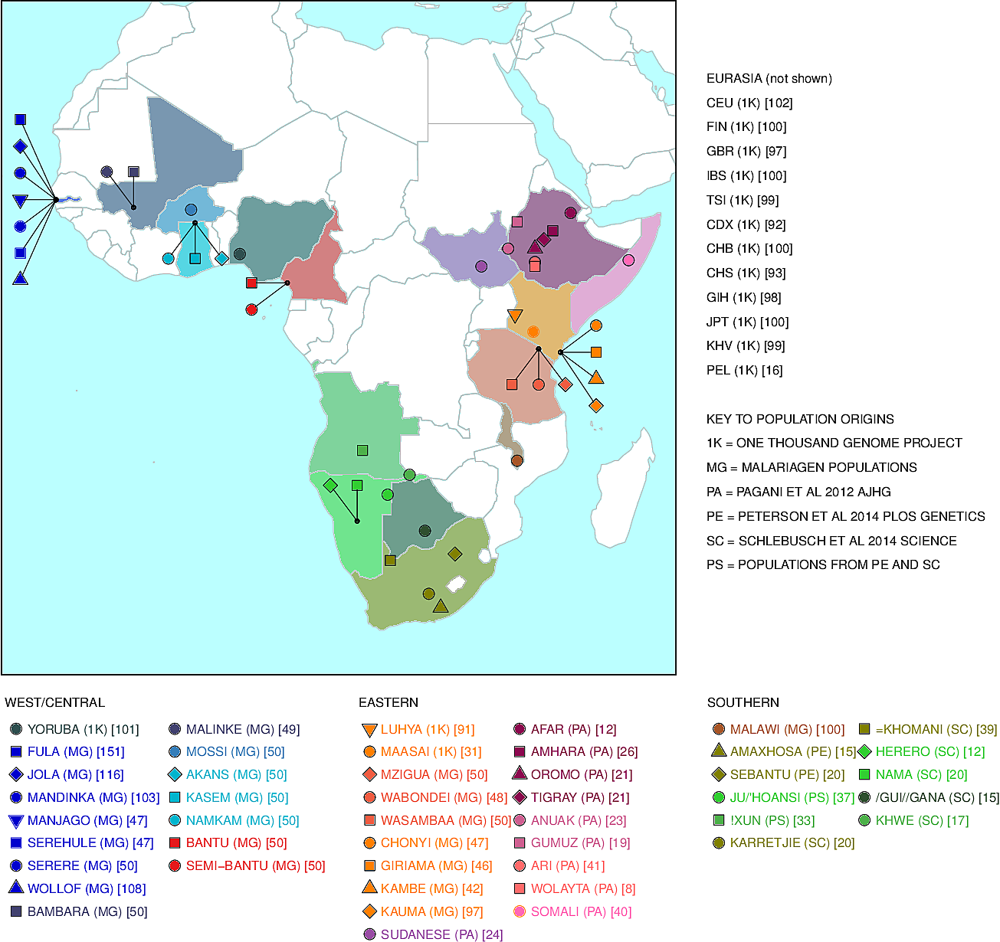

# Admixture into and within Sub-Saharan Africa

## Summary
I've put various pieces of code in this repository, mostly to do with work on admixture and natural selection with a pan-African dataset.

## Overview of file system

### data/
various files containing the baseline data used for plotting

### figures/
contains figures generated from plotting_scripts

### packages_dev/
a directory of package(s) where I have started to store useful functions (mostly for plotting)

### packages_ext/
external libraries that I use, for example, Dan Lawson's library for editing fineSTRUCTURE output

### plotting_scripts/
code to make plots for what will be final paper figures

